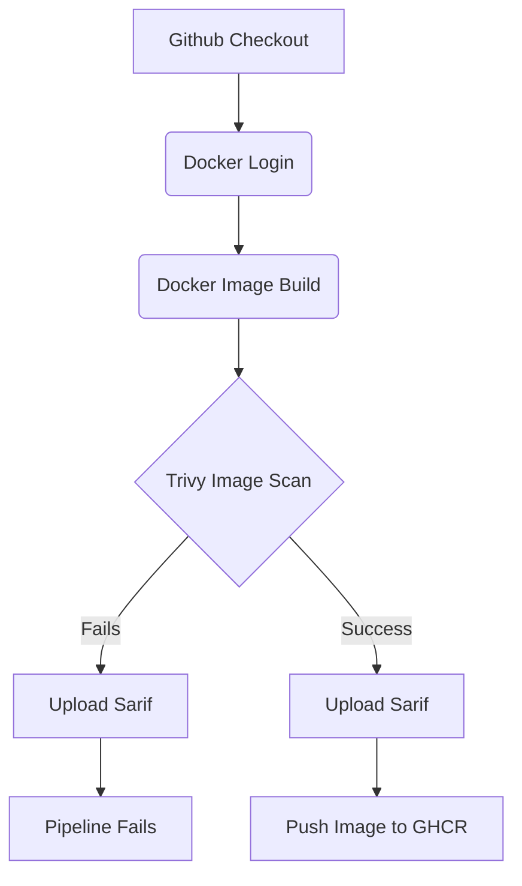

# Container Image Security Scanner Pipeline
A demonstration of how container security scans made by **Aqua Security Trivy** for Dockerfiles and container images, with integrating this scan process to Github Actions Workflow
## Overview

The project contains two parallel pipelines — one intentionally vulnerable and one hardened — to illustrate the real-world impact of dependency management and Dockerfile best practices on container security posture.

| Image | Base | Python | Python vulns | OS vulns (CRITICAL/HIGH) | Dockerfile issues |
|-------|------|--------|-------------|--------------------------|-------------------|
| `vulnerable-image` | `python:3.8-slim` (Debian 12) | 3.8 | 11 HIGH | 7 CRITICAL, 39 HIGH | 2 (root user, no HEALTHCHECK) |
| `container-image-security-scanner` | `python:3.14-slim` (Debian 13) | 3.14 | **0** | **0 CRITICAL**, 4 HIGH | **0** |

## Project Structure

```
.
├── app/
│   └── main.py                  # FastAPI application (CRUD REST API)
├── .github/
│   └── workflows/
│       ├── build-vulnerable.yml  # Pipeline for the intentionally vulnerable image
│       └── build-fixed-image.yml # Pipeline for the hardened image
├── Dockerfile                   # Hardened image (non-root user, HEALTHCHECK)
├── Dockerfile.vulnerable        # Vulnerable image (runs as root, no HEALTHCHECK)
├── requirements.txt             # Up-to-date dependencies
├── requirements-old.txt         # Outdated/vulnerable dependencies
└── docs/
    ├── before-scan.md           # Trivy scan results on the vulnerable image
    └── after-scan.md            # Trivy scan results on the fixed image
```

There is two different Dockerfiles. **Dockerfile.vulnerable** file doesn't have any Healtcheck stage, and has not secure image building.

**Key problems**:
- Python 3.8 base (`Debian 12`) ships with CRITICAL CVEs in `libgnutls30`, `libssl3`, `libsqlite3-0`, and `zlib1g`
- Old Python packages: `Werkzeug 2.0.3`, `starlette 0.25.0`, `urllib3 1.26.x`, `setuptools 57.5.0` — all carrying HIGH severity CVEs
- Container runs as root, enabling container escape scenarios

On the other hand, **Dockerfile** have healtcheck and it build more securely.

**Improvements**: Non-root user, HEALTHCHECK, Python 3.14 base, fully updated Python packages (zero Python-level CVEs).

## Pipeline Design
There are two different pipelines to show action. There are similar some ways. However after Trivy scan, they have different actions

### Pipeline Flowchart


## Scan Results Summary

### Before (vulnerable image — `python:3.8-slim`, Debian 12)

**OS vulnerabilities**: 46 total — **7 CRITICAL, 39 HIGH**

Notable CVEs:
| Package | CVE | Severity | Impact |
|---------|-----|----------|--------|
| `libgnutls30` | CVE-2026-33845, CVE-2026-42010 | CRITICAL | DoS, authentication bypass |
| `libssl3` / `openssl` | CVE-2026-31789 | CRITICAL | Heap buffer overflow, RCE potential |
| `libsqlite3-0` | CVE-2025-6965, CVE-2025-7458 | CRITICAL | Integer truncation/overflow |
| `zlib1g` | CVE-2023-45853 | CRITICAL | Integer overflow, heap buffer overflow |

**Python package vulnerabilities**: 11 total — **11 HIGH**

| Package | CVE | Impact |
|---------|-----|--------|
| `Werkzeug 2.0.3` | CVE-2024-34069 | Remote code execution on developer machines |
| `setuptools 57.5.0` | CVE-2024-6345 | Remote code execution via package index |
| `urllib3 1.26.20` | CVE-2025-66418 | Unbounded decompression, resource exhaustion |
| `starlette 0.25.0` | CVE-2024-47874 | Denial of Service via multipart/form-data |

**Dockerfile misconfigurations**: 2

- `DS-0002` HIGH — No `USER` instruction (container runs as root)
- `DS-0026` LOW — No `HEALTHCHECK` instruction

### After (fixed image — `python:3.14-slim`, Debian 13)

**OS vulnerabilities**: 97 total — **0 CRITICAL, 4 HIGH** (all `affected`/no fix available)

**Python package vulnerabilities**: **0** across all packages

**Dockerfile misconfigurations**: **0**

The remaining OS-level findings are either LOW/MEDIUM severity or carry `affected` status with no fix released yet — none would block the pipeline under the `ignore-unfixed: true` + `CRITICAL,HIGH` configuration.

## Key Takeaways

1. **Base image version matters**: Upgrading from `python:3.8-slim` (Debian 12) to `python:3.14-slim` (Debian 13) eliminated all CRITICAL OS CVEs that had available fixes.
2. **Dependency pinning ages badly**: Packages pinned to 2022-era versions (`Werkzeug 2.0.3`, `urllib3 1.26`, `starlette 0.25`) accumulate HIGH severity CVEs over time.
3. **Dockerfile linting catches runtime risks**: Running as root and missing a HEALTHCHECK are surfaced as misconfigurations before the image ships.
4. **`exit-code: 1` as a security gate**: Setting this in the vulnerable pipeline enforces a hard stop — no image is pushed when CRITICAL/HIGH fixable CVEs are present.
5. **`ignore-unfixed: true` reduces noise**: Only actionable findings (ones with a known patch) trigger failures, avoiding alert fatigue from issues the maintainer cannot yet fix.

## Running Locally

**Scan the vulnerable image**:
```bash
docker build -t vuln-app:latest -f Dockerfile.vulnerable .
trivy image --scanners vuln vuln-app:latest
trivy config Dockerfile.vulnerable
```

**Scan the fixed image**:
```bash
docker build -t secure-app:latest .
trivy image --scanners vuln secure-app:latest
trivy config Dockerfile
```


## Requirements

- Docker
- [Trivy](https://github.com/aquasecurity/trivy) 
- GitHub repository with Actions enabled and `packages: write` permission for GHCR push